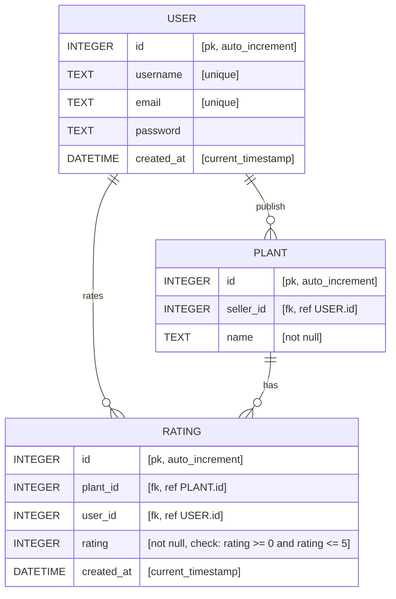

# Entity Relationship Diagram

## Diagram

## Relations description

- `USER` can plublish ZERO or UNLIMITED `PLANT`s
- `USER` can create ZERO or UNLIMITED `RATING`s
- `PLANT` can have ZERO or UNLIMITED `RATING`s
- Each `RAGING` is created by ONE `USER`
- Each `RATING` belongs to ONE `PLANT`
- Each ``PLANT` is published by ONE `USER`
